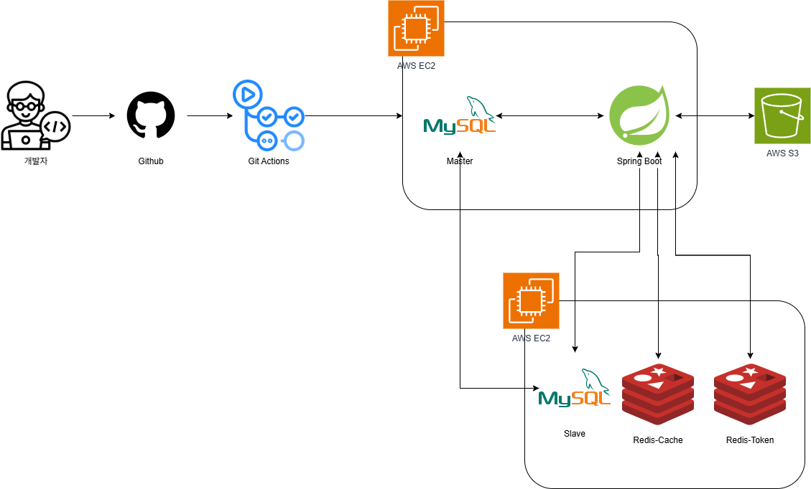
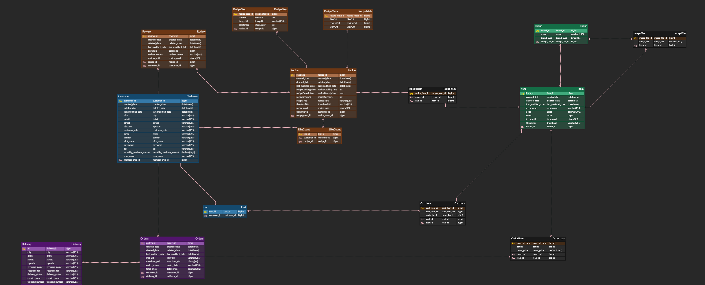
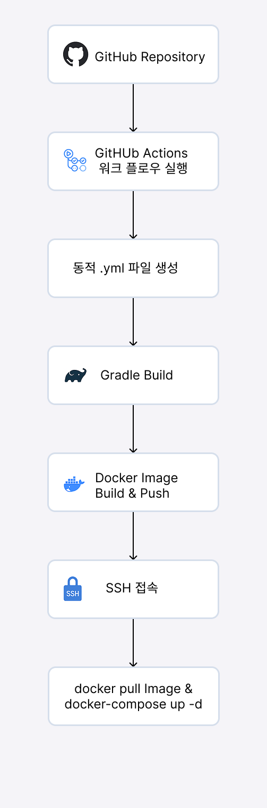
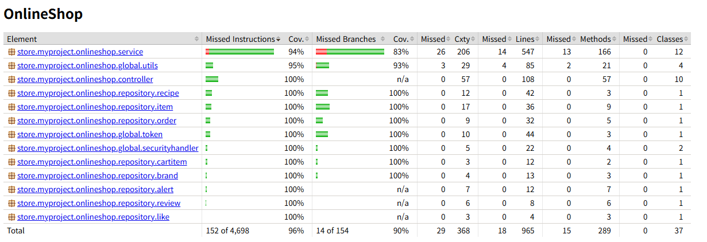

# 🛒 오늘의 식탁 – 레시피 기반 쇼핑 API

오늘의 식탁은 레시피를 기반으로 식재료를 쉽게 구매할 수 있도록 지원하는 백엔드 API 서비스입니다.

---

## 🛠 기술 스택

**Backend**

- Java 17
- Gradle
- Spring Boot 3.0.6
- Spring Data JPA
- Spring Security
- QueryDsl 5.1.0
- MySQL 8.0.33
- Redis 7.0

**배포**

- Git Actions
- Docker
- Docker-Compose
- AWS EC2

---

## 📃 아키텍처

---

## 🗄️ ERD

---

## 📡 API 명세서

- [Swagger](http://mystudyproject.store:8080/swagger-ui/index.html)

---

## 🚀 GitActions을 활용한 배포 자동화

자동화된 배포 파이프라인을 구성하여, GitHub에 코드 푸시 시 Docker 이미지 빌드 및 EC2 서버에 배포가 자동으로 이루어집니다.

## 🧪 테스트

### ✅ 단위 테스트 (Unit Test)
- Mockito를 활용해 주요 비즈니스 로직 단위 테스트 수행
- Fixture 패턴을 도입해 반복적인 테스트 데이터를 효율적으로 관리

### 📈 테스트 커버리지

- 테스트 커버리지를 일정 수준 이상 확보했으나, 의미 없는 테스트 코드도 포함되어 있어 다음 프로젝트에서는 테스트의 질 중심의 작성 전략 개선 예정

## 📝 블로그 정리

[좋아요 개수, 댓글 개수, 조회 수 테이블 분리 리팩토링](https://until.blog/@zvyg1023/%EC%A2%8B%EC%95%84%EC%9A%94-%EA%B0%9C%EC%88%98--%EB%8C%93%EA%B8%80-%EA%B0%9C%EC%88%98--%EC%A1%B0%ED%9A%8C-%EC%88%98-%ED%85%8C%EC%9D%B4%EB%B8%94-%EB%B6%84%EB%A6%AC-%EB%A6%AC%ED%8C%A9%ED%86%A0%EB%A7%81)

[Git Actions와 docker-compose를 이용한 자동 배포](https://velog.io/@zvyg1023/CICD-Docker-Github-Action-Spring-Boot)

[MySQL 데이터 분산 처리를 위한 Master-Slave 이중화 구축 - 같은 서버에 위치한 MySQL](https://velog.io/@zvyg1023/mysql-master-slave)

[MySQL 데이터 분산 처리를 위한 Master-Slave 이중화 구축 - 같은 VPC 내 서로 다른 서버에 위치한 MySQL](https://until.blog/@zvyg1023/mysql-replication-%EC%84%A4%EC%A0%95)

[MySQL 데이터 분산 처리를 위한 Master-Slave 이중화 구축 (Spring Boot, JPA 설정)](https://velog.io/@zvyg1023/spring-boot-mysql-master-slave)

## 🚧 Trouble Shooting

[@RequestPart를 이용한 MultipartFile, DTO 처리 및 테스트](https://velog.io/@zvyg1023/Spring-Boot-RequestPart%EB%A5%BC-%EC%9D%B4%EC%9A%A9%ED%95%9C-MultipartFile-DTO-%EC%B2%98%EB%A6%AC-%EB%B0%8F-%ED%85%8C%EC%8A%A4%ED%8A%B8)

[Swagger에서 @ReqeustPart를 사용하여 MultiPartFile과 DTO 처리 시 Content type 'application/octet-stream' not supported 오류 해결](https://velog.io/@zvyg1023/Spring-Boot-Swagger%EC%97%90%EC%84%9C-ReqeustPart%EB%A5%BC-%EC%82%AC%EC%9A%A9%ED%95%98%EC%97%AC-MultiPartFile%EA%B3%BC-DTO-%EC%B2%98%EB%A6%AC-%EC%8B%9C-Content-type-applicationoctet-stream-not-supported-%EC%98%A4%EB%A5%98-%ED%95%B4%EA%B2%B0)

[Docker Volume으로 인해 MySQL 컨테이너 재실행시 스키마 안 생기는 이슈 해결](https://velog.io/@zvyg1023/docker-volume-schema-issue)

[MySQL Replication Last_IO_Error : Access denied](https://velog.io/@zvyg1023/MySQL-MySQL-Replication-LastIOError-Access-denied-%EC%9D%B4%EC%8A%88-%ED%95%B4%EA%B2%B0)

[Worker 1 failed executing transaction 'ANONYMOUS' at source log mysql-bin.000003, end_log_pos 16969. 이슈](https://velog.io/@zvyg1023/Worker-1-failed-executing-transaction-ANONYMOUS-at-source-log-mysql-bin.000003-endlogpos-16969)

[MySQL Replication 인증 오류 (caching_sha2_password)](https://until.blog/@zvyg1023/mysql-replication-%ED%8A%B8%EB%9F%AC%EB%B8%94%EC%8A%88%ED%8C%85---%EC%9D%B8%EC%A6%9D-%EC%98%A4%EB%A5%98--caching-sha2-password-)
