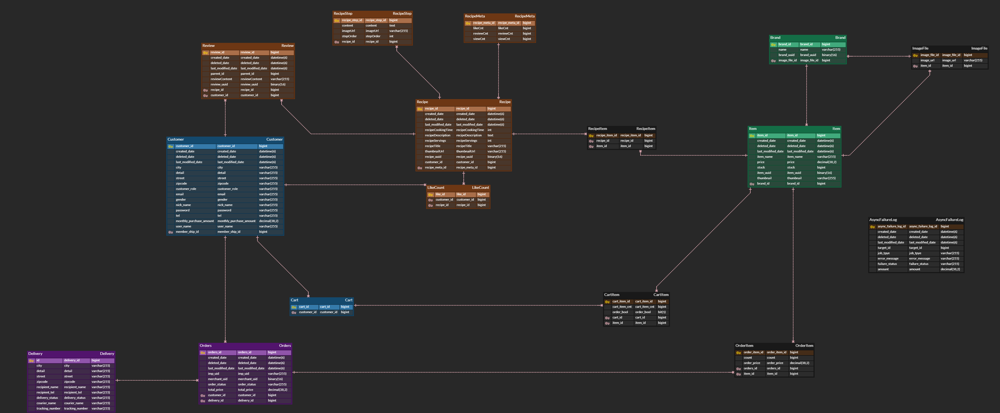

# 🛒 오늘의 식탁 – 레시피 기반 쇼핑 API

오늘의 식탁은 레시피를 기반으로 식재료를 쉽게 구매할 수 있도록 지원하는 백엔드 API 서비스입니다.

## 📌 주요 기능

### 🥘 **레시피 (Recipe)**
- **레시피 등록** (`POST /api/v1/recipes`)  
  사용자가 직접 레시피를 등록할 수 있습니다.
- **레시피 삭제** (`DELETE /api/v1/recipes/{recipeId}`)  
  특정 레시피를 삭제할 수 있습니다.
- **레시피 좋아요** (`POST /api/v1/recipes/{id}/likes`)  
  특정 레시피에 좋아요를 누를 수 있습니다.
- **레시피 좋아요 개수 조회** (`GET /api/v1/recipes/{id}/likes`)  
  특정 레시피의 좋아요 개수를 조회할 수 있습니다.

### 💬 **리뷰 (Review)**
- **댓글 작성** (`POST /api/v1/recipes/{id}/reviews`)  
  특정 레시피에 대한 리뷰(댓글)를 작성할 수 있습니다.
- **댓글 수정** (`POST /api/v1/recipes/{id}/reviews/{reviewId}`)  
  작성한 댓글을 수정할 수 있습니다.
- **댓글 삭제** (`DELETE /api/v1/recipes/{id}/reviews/{reviewId}`)  
  작성한 댓글을 삭제할 수 있습니다.

### 📦 **주문 (Order)**
- **단건 주문** (`POST /api/v1/orders`)  
  개별 주문을 등록할 수 있습니다.
- **장바구니 주문** (`POST /api/v1/orders/cart`)  
  장바구니 내 모든 품목을 한 번에 주문할 수 있습니다.
- **주문 조회** (`GET /api/v1/orders/{orderId}`)  
  사용자의 주문 정보를 조회할 수 있습니다.
- **주문 취소** (`DELETE /api/v1/orders/{orderItemId}`)  
  특정 주문을 취소할 수 있습니다.

### 🛒 **장바구니 (Cart)**
- **장바구니 품목 추가** (`POST /api/v1/carts`)  
  장바구니에 품목을 추가할 수 있습니다.
- **장바구니 품목 조회** (`GET /api/v1/carts`)  
  사용자의 장바구니에 담긴 품목을 조회할 수 있습니다.
- **장바구니 품목 삭제** (`DELETE /api/v1/carts/{itemId}`)  
  특정 품목을 장바구니에서 삭제할 수 있습니다.
- **장바구니 전체 품목 삭제** (`DELETE /api/v1/carts`)  
  장바구니 내 모든 품목을 삭제할 수 있습니다.

### 🏪 **상품 (Item)**
- **상품 등록** (`POST /api/v1/items`)  
  새로운 상품을 추가할 수 있습니다.
- **상품 수정** (`PUT /api/v1/items/{itemId}`)  
  기존 상품 정보를 수정할 수 있습니다.
- **상품 삭제** (`DELETE /api/v1/items/{itemId}`)  
  특정 상품을 삭제할 수 있습니다.
- **상품 조회** (`GET /api/v1/items/{itemId}`)  
  개별 상품 정보를 조회할 수 있습니다.

### 🚚 **배송 (Delivery)**
- **배송지 변경** (`PUT /api/v1/deliveries/{orderId}`)  
  주문의 배송지를 변경할 수 있습니다.

### 👤 **회원 (Customer)**
- **회원 가입** (`POST /api/v1/customers/join`)  
  신규 회원을 등록할 수 있습니다.
- **로그인** (`POST /api/v1/customers/login`)  
  사용자 로그인 기능을 제공합니다.
- **로그아웃** (`POST /api/v1/customers/logout`)  
  사용자 로그아웃을 처리합니다.
- **회원 정보 조회** (`GET /api/v1/customers`)  
  사용자의 회원 정보를 조회할 수 있습니다.
- **회원 정보 수정** (`PATCH /api/v1/customers`)  
  회원 정보를 수정할 수 있습니다.
- **회원 탈퇴** (`DELETE /api/v1/customers`)  
  사용자의 계정을 삭제할 수 있습니다.

### 🎟 **멤버십 (Membership)**
- **멤버십 등록** (`POST /api/v1/memberships`)  
  멤버십을 등록할 수 있습니다.
- **멤버십 조회** (`GET /api/v1/memberships/{id}`)  
  특정 멤버십 정보를 조회할 수 있습니다.
- **멤버십 삭제** (`DELETE /api/v1/memberships/{id}`)  
  특정 멤버십을 삭제할 수 있습니다.

### 🔔 **알림 (SSE)**
- **알림 구독** (`GET /api/v1/subscribe/{id}`)  
  사용자는 SSE(Server-Sent Events)를 통해 실시간 알림을 받을 수 있습니다.

### 🏢 **브랜드 (Brand)**
- **브랜드 등록** (`POST /api/v1/brands`)  
  새로운 브랜드를 등록할 수 있습니다.
- **브랜드 조회** (`GET /api/v1/brands/{brandId}`)  
  특정 브랜드 정보를 조회할 수 있습니다.
- **브랜드 삭제** (`DELETE /api/v1/brands/{brandId}`)  
  특정 브랜드를 삭제할 수 있습니다.

---

## 🛠 기술 스택

**언어 / 툴**

- Java 17
- Intellij Ultimate
- Gradle

**Backend**

- Spring Boot 3.0.6
- Spring Data JPA
- Spring Security
- QueryDsl
- MySQL
- Redis

**배포**

- Git Actions
- Docker
- Docker-Compose
- AWS EC2

---

## 📃 아키텍처

---

### 배포 흐름

## 📡 API 명세서

- [Swagger](http://mystudyproject.store:8080/swagger-ui/index.html)

---

## 🗄️ ERD

---

## 📝 블로그 정리

[Git Actions와 docker-compose를 이용한 자동 배포](https://velog.io/@zvyg1023/CICD-Docker-Github-Action-Spring-Boot)

[MySQL 데이터 분산 처리를 위한 Master-Slave 이중화 구축 - 같은 서버에 위치한 MySQL](https://velog.io/@zvyg1023/mysql-master-slave)

[MySQL 데이터 분산 처리를 위한 Master-Slave 이중화 구축 - 같은 VPC 내 서로 다른 서버에 위치한 MySQL](https://until.blog/@zvyg1023/mysql-replication-%EC%84%A4%EC%A0%95)

[MySQL 데이터 분산 처리를 위한 Master-Slave 이중화 구축 (Spring Boot, JPA 설정)](https://velog.io/@zvyg1023/spring-boot-mysql-master-slave)

## 🚧 Trouble Shooting

[@RequestPart를 이용한 MultipartFile, DTO 처리 및 테스트](https://velog.io/@zvyg1023/Spring-Boot-RequestPart%EB%A5%BC-%EC%9D%B4%EC%9A%A9%ED%95%9C-MultipartFile-DTO-%EC%B2%98%EB%A6%AC-%EB%B0%8F-%ED%85%8C%EC%8A%A4%ED%8A%B8)

[Swagger에서 @ReqeustPart를 사용하여 MultiPartFile과 DTO 처리 시 Content type 'application/octet-stream' not supported 오류 해결](https://velog.io/@zvyg1023/Spring-Boot-Swagger%EC%97%90%EC%84%9C-ReqeustPart%EB%A5%BC-%EC%82%AC%EC%9A%A9%ED%95%98%EC%97%AC-MultiPartFile%EA%B3%BC-DTO-%EC%B2%98%EB%A6%AC-%EC%8B%9C-Content-type-applicationoctet-stream-not-supported-%EC%98%A4%EB%A5%98-%ED%95%B4%EA%B2%B0)

[Docker Volume으로 인해 MySQL 컨테이너 재실행시 스키마 안 생기는 이슈 해결](https://velog.io/@zvyg1023/docker-volume-schema-issue)

[MySQL Replication Last_IO_Error : Access denied](https://velog.io/@zvyg1023/MySQL-MySQL-Replication-LastIOError-Access-denied-%EC%9D%B4%EC%8A%88-%ED%95%B4%EA%B2%B0)

[Worker 1 failed executing transaction 'ANONYMOUS' at source log mysql-bin.000003, end_log_pos 16969. 이슈](https://velog.io/@zvyg1023/Worker-1-failed-executing-transaction-ANONYMOUS-at-source-log-mysql-bin.000003-endlogpos-16969)

[MySQL Replication 인증 오류 (caching_sha2_password)](https://until.blog/@zvyg1023/mysql-replication-%ED%8A%B8%EB%9F%AC%EB%B8%94%EC%8A%88%ED%8C%85---%EC%9D%B8%EC%A6%9D-%EC%98%A4%EB%A5%98--caching-sha2-password-)
